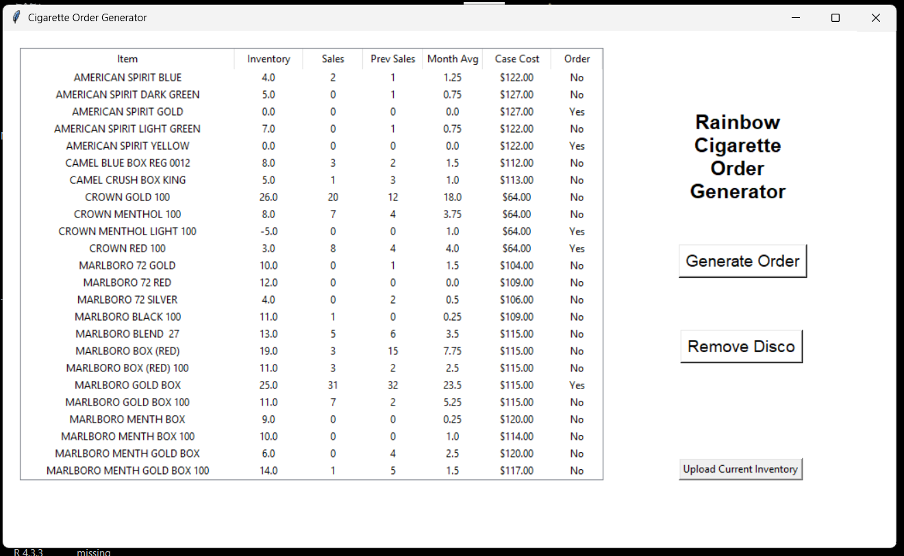
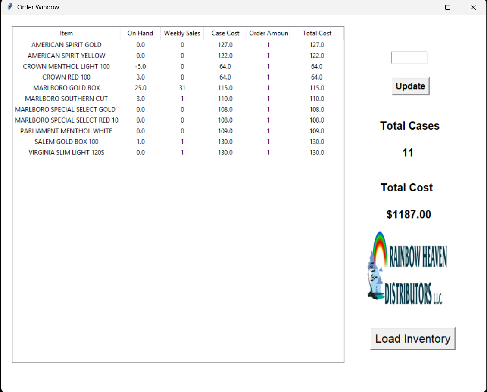
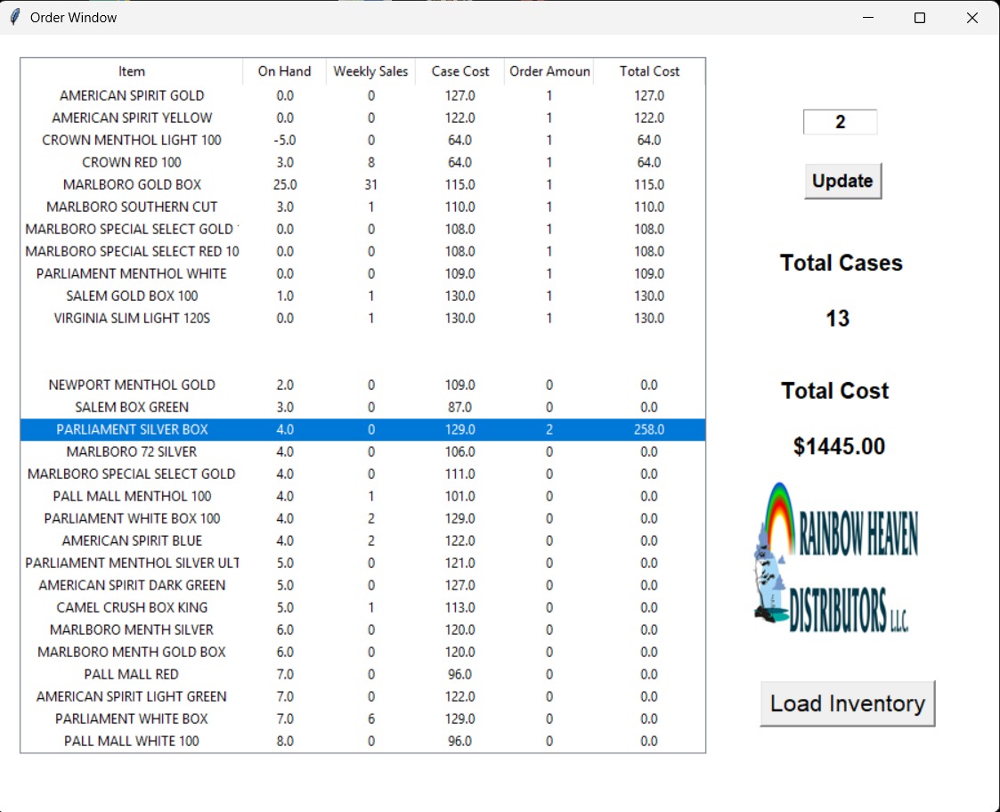

# Rainbow Order Generator

Rainbow Order Generator is a python based application that 
creates cigarette orders based on WinePOS data.

## Application

### Inventory Dashboard

### Order Generator

### Full Inventory

## Overview

Cigarette orders are generated by combining current inventory, 
historical sales data based on recent previous weeks, and an average
of those weekly sales. Suggested order amounts are based on case size
and how many packs are sold on average.

Current inventory and current weekly sales are generated from WinePOS
JSON data and cleaned before being stored in a Postgres database.
The program's GUI is created using Tkinter.

## Features

Retrieves current inventory from POS system
Retrieves last week's sales from POS system
Stores inventory and weeks sales in SQL database
Calculates 4-week average
Suggests whether to order based on current inventory and sales
Suggests ordering multiple cases based on sales and case size
Calculates order quantities and order total costs
Provides graphical user interface to update current inventory and sales data
Provides GUI that allows to customize generated orders
Allows to remove inventory that is no longer necessary to order
Adjusts inventory so GUI matches what is currently in the store

## Technologies

Python
Pandas
NumPy
Tkinter
PgAdmin
Postgres
Requests
Psycopg2

## Project Structure

'current_inventory.py' - Retrieves current days inventory
'database.py' - Postgres database connection
'main.py' - Main application and graphical user interface
'upload_to_db.py' - Functions to upload current inventory and weekly sales to postgres
'vision_master_filter.py' - Filters initial store inventory to only data necessary
'weekly_sales.py' - Retrieves weekly sales from previous Monday through Sunday

'remove_ciggs - Sheet1.csv' - Allows program to adjust inventory based on store supply not matching POS inventory
'remove_list' - Function adds items to remove list so they are no longer displayed
'vision_inventory' - Initial POS inventory

## Purpose

This project was built to automate a repetitive inventory 
and ordering process while applying practical programming, 
database, and data-analysis techniques to a real-world problem
